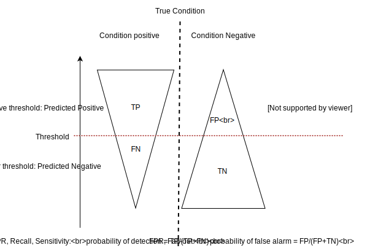

# Understanding precision, recall, roc curve

For classification problems in machine learning, some classifiers usually output a score (e.g. probability, decision score). And it is your choice of a threshold to decide the positive and negative classes.

There are [many different metrics](https://en.wikipedia.org/wiki/Precision_and_recall) to evaluate the performance according to the score distribution. Here I try to make some of them more clear:

There're two triangles in the graph. The left one represents all condition positive samples. And the right one represents all condition negative samples.

The y axis (or the vertical direction) represents the decision score. The red dotted line is the threshold we choose.

For a good classifier, we should expect more positive samples to have higher scores, and more negative samples to have lower scores. So the left triangle is up side down.

Some metrics are showed in the graph as well. 

Now let's try to move the threshold. If the threshold goes up:

- recall decreases, precision increases, they move to different direction, so the precision-recall curve shows a decreasing fuction, like [these](http://scikit-learn.org/stable/auto_examples/model_selection/plot_precision_recall.html)
- TPR (or recall) decreases, FPR also decreases, they move to the same direction, so the ROC curve shows a increasing function